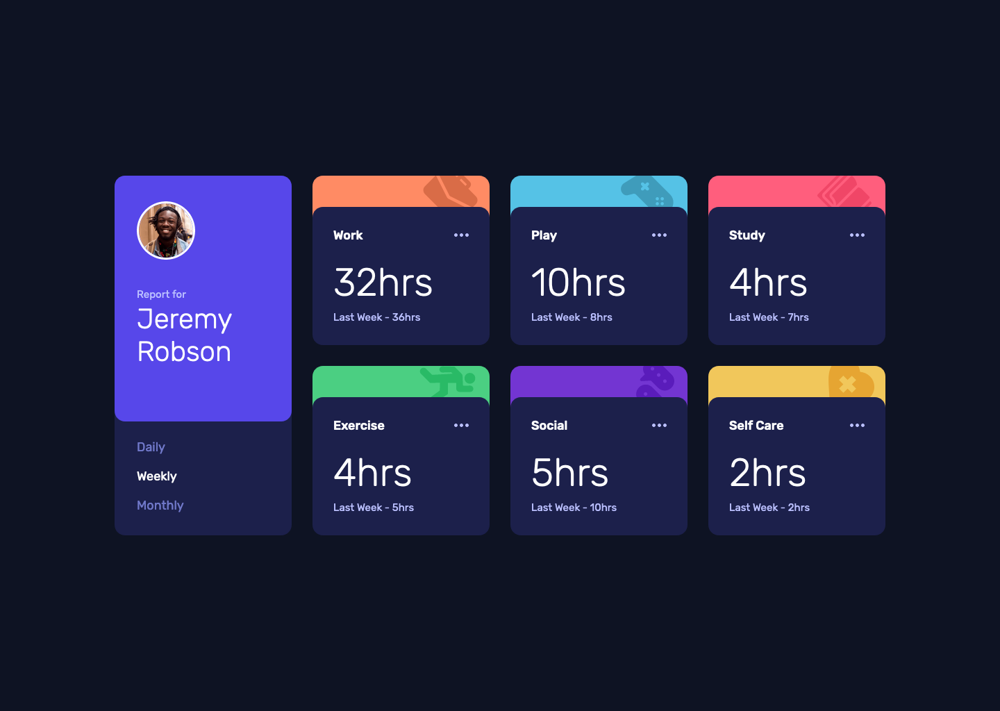

# Time tracking dashboard solution

This is a solution to the [Time tracking dashboard challenge on Frontend Mentor](https://www.frontendmentor.io/challenges/time-tracking-dashboard-UIQ7167Jw). Frontend Mentor challenges help you improve your coding skills by building realistic projects.

This project features a time management dashboard in a visually appealing dark-themed design, built using HTML for structure, CSS for styling, and JavaScript to handle rendering dynamic content.

| **Links** | [Live Demo URL](https://ionstici.github.io/time-tracking-dashboard) | [Frontend Mentor](https://www.frontendmentor.io/solutions/time-tracking-dashboard-LUO5g9aGLm) |
| --------- | ------------------------------------------------------------------- | --------------------------------------------------------------------------------------------- |

Open Preview Image

 

 

## Features

-   **Daily, Weekly, Monthly Views:** Users can switch between different time frames to view the time usage.
-   **Responsive Design:** Ensures the dashboard looks good and functions well on any device.

## Technologies used

-   **HTML5:** For creating the structure of the dashboard.
-   **CSS3:** For styling, ensuring a clean and modern look.
-   **JavaScript:** To manage the interactivity, like switching between time frames and displaying detailed data.
